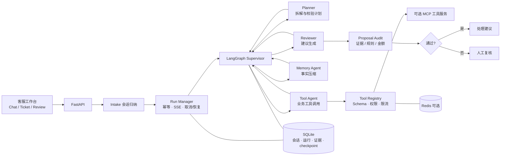

# AegisFlow

**电商售后多智能体决策工作台**

面向客服场景的 LLM Agent 个人项目：顾客描述售后问题后，系统归纳诉求、创建工单，并在多智能体协作下生成可审计的售后处理建议。

模型负责拆解与建议；资格、金额、证据与权限由业务规则审核。系统输出的是建议，不执行真实退款或赔付。

---

## 项目背景

售后决策对错误很敏感：金额偏差、证据不足、越权操作都可能造成资损。仅靠多轮对话，很难复盘「为什么给出这个建议」，也很难约束模型不能做什么。

这个项目关心的是：在售后这样的业务约束下，LLM 应如何被接入一条**可追溯、可审核、可人工接管**的工作流，而不是一个自由发挥的聊天窗口。

---

## 系统能做什么

客服在工作台描述问题（或粘贴订单号）后，Intake 会将对话归纳为结构化诉求；信息不足时先追问，而不是强行建单。工单创建后进入 LangGraph 编排的多智能体流程，实时展示进度，最终给出处理建议或转入人工复核。

| 模块 | 内容 |
|------|------|
| 客服会话 | 自然语言入站 → Intake 归纳 → 工单与 Run；进度与结果通过 SSE 推送 |
| 编排 | Supervisor-Worker：Planner / Tool / Memory / Reviewer，受步骤预算约束 |
| 业务工具 | 订单、物流、售后规则、资格校验、补偿计算等，严格 Schema、限流与权限等级 |
| 审核 | Reviewer 生成建议后，服务端再用策略与审计代码校验证据、规则与金额 |
| 知识检索 | 售后 SOP、FAQ、模拟历史案例；其中只有 SOP 规则可作为资格依据 |
| 人工复核 | 高风险或证据不足时进入领取队列，高级客服可同意 / 拒绝 / 要求补证据 |
| 持久化 | 会话、运行事件与 LangGraph checkpoint 写入 SQLite；Redis 可选用于缓存与限流 |
| 工具服务 | 同一套 ToolRegistry 可本地执行，也可作为鉴权后的 MCP Streamable HTTP 服务部署 |
| 评测与观测 | JSON / Langfuse 追踪；离线评测关注证据覆盖与规则引用，可选 Ragas 与 LLM Judge |

---

## 架构



常见终态：`completed`、`manual_review`、`failed`、`cancelled`。服务重启后未完成任务记为 `paused`，由客服显式恢复。

---

## 技术栈

| 层 | 选型 |
|----|------|
| 后端 | Python 3.11+ · FastAPI · Pydantic v2 · uvicorn |
| 编排 | LangGraph（Supervisor-Worker）· SQLite checkpoint |
| 模型 | OpenAI 兼容协议（可配 DashScope / Qwen 等） |
| 工具 | 本地类型化执行器 + MCP Streamable HTTP |
| 存储 | SQLite · Redis（可选） |
| 前端 | HTML / CSS / JS 工作台 · Lucide · SSE |
| 质量 | pytest · Playwright · GitHub Actions |

---

## 快速开始

### 本地运行

```powershell
# Python 3.11+
python -m pip install -r requirements.txt
uvicorn app.main:app --host 127.0.0.1 --port 8000 --workers 1
```

参照 `.env.example` 配置 `.env`（OpenAI 兼容的 `OPENAI_API_KEY` / `OPENAI_BASE_URL` / `LLM_MODEL` 等）。

- 工作台：http://127.0.0.1:8000  
- API 文档：http://127.0.0.1:8000/docs  

默认 `DEMO_AUTH=true`：浏览器获得服务端签发的演示客服身份（权限等级 1）。业务数据为模拟订单、规则与已核验证据。

### Docker

```bash
docker compose up --build
```

平台与 Redis 一并启动，数据库写入命名卷 `aegisflow-data`。独立 MCP 工具服务：

```bash
# 配置非空 MCP_API_KEY
docker compose --profile mcp up --build
```

### MCP 工具服务（单独进程）

```powershell
# 配置 MCP_API_KEY
python -m app.mcp_server
```

平台侧设置 `MCP_URL` 与相同 `MCP_API_KEY`。客户端启动时执行 `initialize` / `tools/list` 校验参数契约，工具通过 `tools/call` 调用。

### 身份与权限

生产环境设 `DEMO_AUTH=false`，在服务端配置 `API_USERS`（token → actor / tenant / level / 可访问工单）。身份与权限由服务端决定，客户端不能自行声明。

---

## 工作台

工作台包含三个视图：

1. **客服会话** —— 描述问题、关联订单、查看处理进度与建议  
2. **工单管理** —— 工单的创建、修改、回收站；详情页展示诉求、时间线与证据  
3. **人工复核** —— 待审任务列表，支持领取与裁决  

工单详情左侧是客户诉求、处理建议与执行记录；右侧固定展示订单物流、工具证据、规则依据与会话摘要，便于对照复盘。

---

## 处理流程

```text
顾客描述
   │
   ▼
Intake 结构化归纳（after_sale / question / greeting）
   │  信息不足时追问；用户陈述不会被写成已核验证据
   ▼
创建工单并启动 Run（幂等键防止重复建单）
   │
   ▼
Supervisor 按计划游标派发 Worker（MAX_STEPS 内）
   │
   ├─ Planner   拆解步骤，校验工具名、参数与权限范围
   ├─ Tool      执行业务工具，结果落入证据档案
   ├─ Memory    压缩事实，供后续节点使用（摘要不作为资格依据）
   └─ Reviewer  在已核验证据与检索规则基础上生成建议草稿
   │
   ▼
服务端 Proposal Audit
   │  规则引用 · 证据调用 ID · 金额 · 动作互斥 · 操作员权限
   ▼
completed 处理建议   或   manual_review 人工接管
```

流程中若干约束直接写在代码与 Schema 里，而不是只写在提示词里：

- 计划必须以唯一的 `reviewer` 步骤结束；审核前必须有 memory 步骤  
- 工具参数严格校验，且限制在当前工单 / 订单范围内  
- `rule_refs` 只能引用检索到的 SOP 规则（`R###`）；FAQ 与案例仅用于解释  
- 资格结论来自成功执行的工具调用（如 `check_after_sale_eligibility`）  
- 模型结构化输出失败时有限次重试，仍失败则进入人工，而不是退回自由文本解析  
- Reviewer 之后仍有 `proposal_audit`：用确定性代码复核证据 ID、规则适用性与补偿金额  

---

## 项目结构

```text
AegisFlow/
├── app/
│   ├── main.py              # FastAPI 入口与生命周期
│   ├── config.py            # 环境配置
│   ├── context.py           # LLM / 工具 / RAG / 追踪装配
│   ├── graph.py             # LangGraph 编排与 checkpoint
│   ├── models.py            # 领域模型与方案结构
│   ├── agents/              # Supervisor / Planner / Tool / Memory / Reviewer
│   ├── api/                 # REST 与 SSE
│   ├── services/            # 工具注册、策略、审核、会话、持久化、MCP 客户端
│   ├── llm/                 # OpenAI 兼容客户端与结构化调用
│   ├── data/seed.py         # 模拟订单、物流、规则与工单
│   └── mcp_server.py        # MCP 工具服务
├── static/                  # 客服工作台
├── tests/                   # 回归测试
├── eval/                    # 离线评测
├── docker-compose.yml
└── .github/workflows/regression.yml
```

---

## 业务工具

| 工具 | 作用 | 默认权限 |
|------|------|----------|
| `query_order` | 订单状态与实付金额 | L1 |
| `query_logistics` | 物流轨迹与签收信息 | L1 |
| `query_after_sale_rules` | 售后规则原文 | L1 |
| `check_after_sale_eligibility` | 按工单时间与已核验证据校验资格 | L1 |
| `calculate_compensation` | 按规则与破损等级计算补偿 | L1 |
| `query_user_history` | 用户历史订单与售后记录 | L2 |

工具执行带超时与限流。MCP 服务注册的新工具可被客户端 `tools/list` 发现；参数由 JSON Schema 校验，权限等级来自服务端元数据。

---

## 测试与评测

```powershell
pip install -r requirements-dev.txt
python -m pytest -m "not browser" -q

python -m playwright install chromium
python -m pytest -m browser -q
```

回归覆盖策略审核、工具参数、会话归属、人工流程、幂等与 SSE 重放、取消与 checkpoint 恢复、MCP 协议，以及桌面 / 移动端工作台主流程。GitHub Actions 在 push / PR 时运行，测试使用离线 Scenario LLM，不依赖真实模型密钥。

```powershell
python -m eval.evaluate --limit 6

pip install -r requirements-eval.txt
python -m eval.evaluate --limit 6 --judge --ragas
```

评测报告关注工具证据是否到位、规则引用是否有效、审核是否拦住不合规方案；启用 `--judge` / `--ragas` 时可附加模型评审与 Faithfulness 评分。

---

## License

个人学习与作品展示用途。演示数据为模拟业务；系统输出为处理建议，不执行真实退款或赔付。
